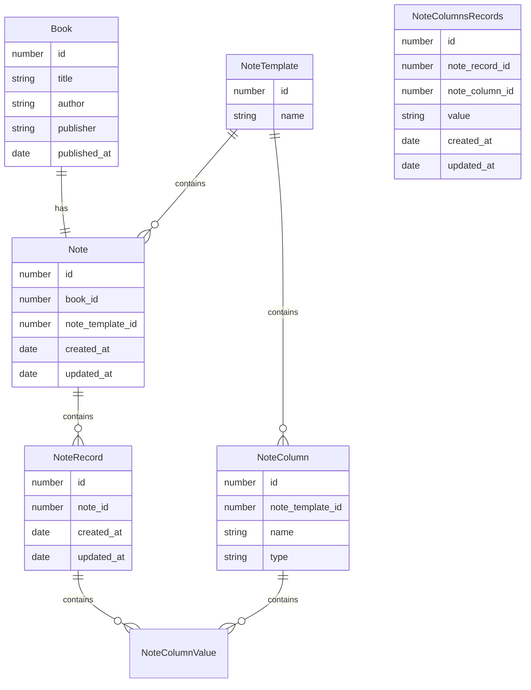
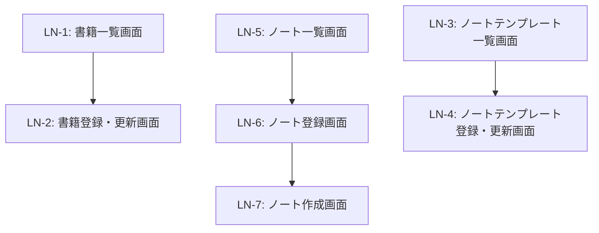

# レーニンノート

## 機能の概要

書籍に関するメモを残すことができる。

- 標準のカラムとして 「抜書」「要約」「ページ数」「行数」「コメント」がある。
- カラムは「ノートテンプレート」で設定する。ノートテンプレートは複数作ることができ、書籍ごとにテンプレートを選択することができる。
- 全文検索にかけれるようにする。

## データモデル

## 画面

- LN-1: 書籍一覧画面
- LN-2: 書籍登録・更新画面
- LN-3: ノートテンプレート一覧画面
- LN-4: ノートテンプレート登録・更新画面
- LN-5: ノート一覧画面
- LN-6: ノート登録画面
- LN-7: ノート作成画面

## 画面遷移

## API

### 書籍

- 書籍一覧取得
- 書籍登録
- 書籍更新
- 書籍削除

### ノートテンプレート

- ノートテンプレート一覧取得
- ノートテンプレート登録
- ノートテンプレート更新
- ノートテンプレート削除

### ノート

- ノート一覧取得
- ノート登録
- ノート更新
- ノート削除

### ノートレコード

- ノートレコード一覧取得
- ノートレコード登録
- ノートレコード更新
- ノートレコード削除
